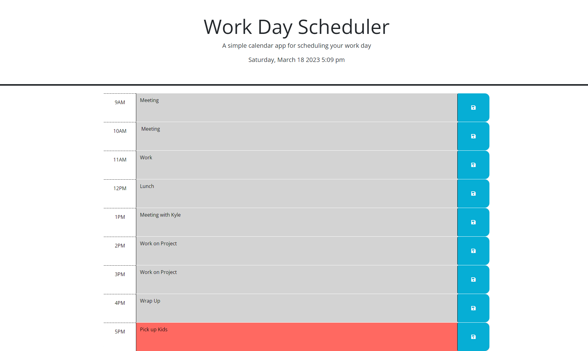

# Work Day Scheduler

## Description

This is a site where you can store your activities you need to complete during the work day, from 9am-5pm. The scheduler is color coded, activities that already happened are in grey. The current hour is colored red. The future hours are colored green. Once you enter your activity, you can click the saved button and the item will be saved and show up upon the refresh. This application was made using HTML, JavaScript, and CSS. Also used was jQuery and day.js.

## Installation

N/A

## Usage

1. Enter task in the appropriate time slot
2. Click the save button on the right
3. Refresh page, and the task will still be there

## Screenshot

## Link to Deployment

https://megmathis.github.io/Day_Scheduler/

https://github.com/MegMathis/Day_Scheduler

## Credits

https://day.js.org/
https://day.js.org/docs/en/display/format

Tutoring by Chris B.

## License

Please refer to LICENSE in repo.
